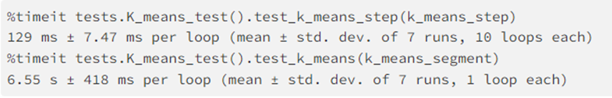
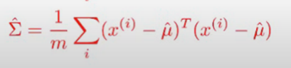
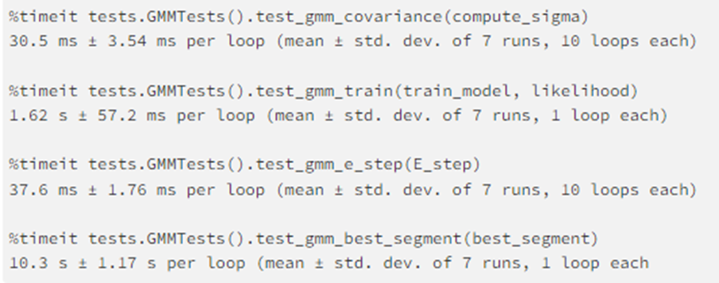

# Assignment 5 - Expectation Maximization - FAQ (Frequently Asked Questions) - CS6601

`Assignment Outline`

Part 1: K-means Clustering (19 pts)

* get_initial_means()

* k_means_step()

* k_means_segment()

Part 2: Implementing a Multivariate Gaussian Mixture Model (48 pts)

* Calculate the probability of a given data point (e.g. rgb value of a pixel) of belonging to a specific Gaussian component. (7 points)

* Use expectation-maximization (EM) to train the model to represent the image as a mixture of Gaussians. (20 points)

* Calculate the log likelihood of the trained model. (7 points)

* Segment the image according to the trained model. (7 points)

* Determine the best segmentation by iterating over model training and scoring, since EM isn't guaranteed to converge to the global maximum. (7 points)

Part 3: Model Experimentation (20 pts)

Part 3a: Improved Initialization (12.5 points)

Part 3b: Convergence Condition (7.5 points)	

Part 4: Bayesian Information Criterion (12 pts)

Part 4a: Implement BIC (4 points)

Part 4b: Test BIC (8 points)

Return Your Name (1 point)

`General FAQ`

* For this assignment, we do not have any bonuses.

* You will be allowed 3 submissions every 3 hours on gradescope. Make sure you test everything before submitting it. The code will be allowed to run for not more than 10 minutes per submission. In order for the code to run quickly, make sure to VECTORIZE the code .

* It is recommended to watch the online walkthrough for A5. It can be found in the Files directory in Canvas here https://gatech.instructure.com/courses/336792/files/folder/CS6601-Assignment-Walkthroughs .

`Part 1: K-means Clustering`

Q:In k-means segment, are we supposed to separate these 3 value tuples into their separate clusters (which would, I guess, be R,G, and B clusters when k=3)? I just don't understand what the clusters are.

A:You need to clusters the RGB data into k clusters (k is the number of clusters, has no relevance to RGB). If this will make more sense you can think that now your X data array is of a shape: number of pixels x 3 (rgb), which you will cluster into k clusters. And then as described in the notebook, update your image values and return a new image.

Q: When using the k-means visualization code (in the cell that immediately follows the k_means_segment cell), should we be getting the exact same image as the reference ones? Or is that not case due to the initial_means being sampled? 

A:K-means is guaranteed to converge but it's sensitive to initialization, meaning that it doesn't necessarily converge to the global optimum. So, the results may vary when initial means are different.

Q: My tests for k_means_segment don't pass.

A: k_means_segment should run the k_means_step until convergence (until the assigned clusters stop changing).

Q: My K-means fails for odd values?

A: Make sure you use np.copy()

Q:How long will k-means typically take?

A:

`Part 2: Implementing a Multivariate Gaussian Mixture Model`

Q: Optional Sigma function and Sigma Function -"Unable to allocate 102. GiB for an array with shape (116966, 116966) and data type float64“

A:Go through the formula very carefully again - maybe try to do one non-vectorized solution before you move to the vectorized one, just to convince yourself you are doing the right math and to know what you should expect from your vectorized solution. Looking at mixture_tests.py can help more.

A:

Q: Could anybody give some hints on how to vectorize the equations in M_step?

A:Make sure you know numpy methods such as np.multiply(), np.dot(), np.sum(), np.expand_dims() etc. and know what axis parameters of these functions does. You might also need to np.resize/np.reshape functions. Try to play with these functions creating simple dummy matrices, don't start with the image data right away, learn what exactly the functions do, what effect does the axis parameter has, and only then transfer it to the assignment. Also try doing simple examples by hand to easily see what you can multiply and sum up to get the desired results, and translate that into code.

Q: How long should part 2 take?

A: 

Here is a list of implementation tips that are helpful for coding up the Multivariate GMM part of the assignment. 

1. If you haven't already, please watch this video by Alexander Ihler: https://www.youtube.com/watch?v=qMTuMa86NzU .

2. It is not mandatory to use np.einsum to vectorize your code. However, using it will significantly help! The official 

documentation of np.einsum is not very intuitive to understand it. Instead, you can watch this video by Aladdin Person: https://youtu.be/pkVwUVEHmfI
In particular, pay attention to the part where the concepts of "Free Indices" and "Summation Indices" are explained. 

3. In addition to using np.einsum, you should also use other methods like np.matmul, np.linalg.det, np.linalg.inv, etc. 
In particular, you should be able to understand what *, @, and np.matmul means and how they are same (or different). That way, you'll be able to know which thing to use where. 

4. Pay extra attention to the shapes of the matrices involved! 

* The data matrix in our codebase (X) has shape (m,n), where m is the number of data points and n is the number of features. 
Since the covariance matrix contains the covariance between each pair of features, you should be able to work out its dimension as (n,n). 

* Now, the video by Alexander Ihle contains a slide, where the formula for multivariate Gaussian is provided. While converting that formula into code, you will realize that blindly following the multiplication order specified in it will result in dimensionality errors in matrix multiplication. 

* To get around that, you should understand that the resultant of the multivariate Gaussian is the probability vector, where a single element reflects the probability value for the corresponding data point. Thus, the probability vector would be of length (m).
Equipped with this information, you can now decide the order in which you will have to multiply the individual terms (and the axis to sum over, as per the conventions in np.einsum) to get to the desired shape. 

* If you are still getting errors doing this step, the best way is to print the shapes of your matrices calculated in the intermediate steps (this will help you check where exactly the implementation is going wrong). 

`Part 3: Model Experimentation`

* If you have difficulty understanding how to implement the new_convergence() function have a look at the default_convergence() function provided by us for reference.

* Please don't use any external packages for anything other than basic calculations. Note that your improvement might significantly slow down runtime, although we don't expect you to spend more than 10 minutes on initialization.

* In the baseline GMM we do random initialization but think as to what is a better way based on what you have completed.

`Part 4: Bayesian Information Criterion`

For part 4b a lot of people had asked for a test case and that has been provided. Please look at the announcement made and follow the instructions to use it. A lot of your queries will be solved by using this test case.

* Look at Wikipedia for more information on BIC.(https://en.wikipedia.org/wiki/Bayesian_information_criterion#:~:text=In%20statistics%2C%20the%20Bayesian%20information%20criterion%20%28BIC%29%20or,closely%20related%20to%20the%20Akaike%20information%20criterion%20%28AIC%29.)

Q: I am not passing the BIC test - what could be the problem?

A:There are a couple of things that you might want to double-check. One is that you may be taking the log of the likelihood result from the method in Part 2, but you do not need to do this as the likelihood you computed in Part 2 already involves a log. Secondly, please make sure that you are using natural log rather than the log base 10.

Overall Look at ED Discussions there are lot of questions resolved which may help you.